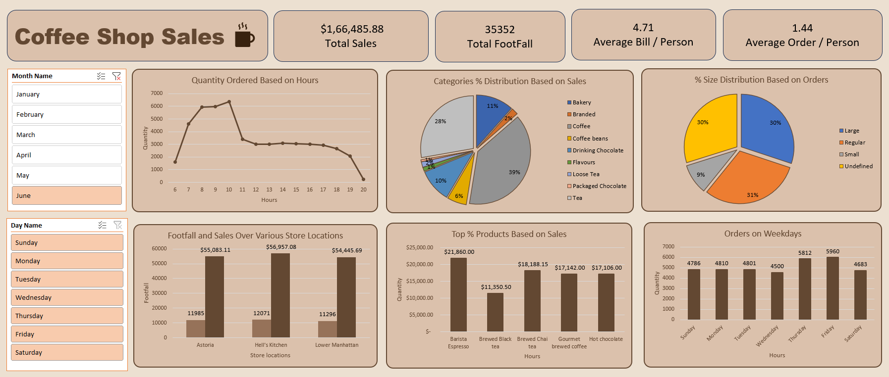

# ☕ Coffee Shop Sales Analysis Dashboard

## 📌 Project Overview
This project focuses on analyzing retail sales data of a coffee shop to extract actionable insights and improve overall business performance. The dashboard helps identify sales trends, customer behavior, and product performance.

---

## 🎯 Objective
The primary objective of this project is to analyze retail sales data and extract actionable insights to improve the overall performance of the coffee shop.

---

## 📊 Dataset Description
The dataset contains transactional sales data, including:

- Order details (quantity, revenue)  
- Date & time (hour, day, month)  
- Store locations  
- Product categories and types  
- Customer behavior metrics (orders, footfall)  

---

## 📈 Key Business Questions (KPIs)

- How do sales vary by day of the week and hour of the day?  
- What are the peak hours for sales activity?  
- What is the total monthly revenue trend?  
- How do sales perform across different store locations?  
- What is the average bill per person and orders per person?  
- Which products are top-performing (quantity & revenue)?  
- How do sales vary across product categories and sizes?  

---

## ⚙️ Project Process

### 🧹 Data Cleaning
- Removed missing and inconsistent records  
- Standardized product categories and store names  
- Converted date-time fields for time-based analysis  

### 🔄 Data Preparation
- Created calculated metrics:
  - Total Sales  
  - Average Bill per Person  
  - Orders per Person  
- Extracted:
  - Hour from timestamp  
  - Day and Month for trend analysis  

### 📊 Data Analysis
- Used Pivot Tables to:
  - Analyze hourly and daily sales patterns  
  - Compare store performance  
  - Identify top-selling products  
- Segmented data by:
  - Category  
  - Size  
  - Location  

### 📉 Dashboard Development
- KPI cards for quick business overview  
- Line chart → hourly order trends  
- Bar charts → product & weekday performance  
- Pie charts → category and size distribution  
- Filters for:
  - Month  
  - Day  

---

## 🖼️ Dashboard Preview

```md

```


---

## 💡 Project Insights

### 📊 Overall Performance
- Total Sales: $166,485.88  
- Total Footfall: 35,352  
- Average Bill per Person: $4.71  
- Average Orders per Person: 1.44  

**Insight:**  
Customers show a low-spend, high-volume behavior, which is typical for a café business model.

---

### ⏰ Time-Based Insights
- Peak orders occur between **8 AM – 10 AM**  
- Significant drop in sales after morning hours  

**Insight:**  
The business is heavily **morning-driven**, with underutilized afternoon potential.

---

### 📅 Weekday Performance
- **Friday and Thursday** have the highest sales  
- Noticeable dip mid-week (especially Wednesday)  

**Insight:**  
There is an opportunity to introduce **mid-week promotions** to boost sales.

---

### 📍 Store Location Performance
- **Hell’s Kitchen** generates the highest revenue (~$56K)  
- Followed by Astoria and Lower Manhattan  

**Insight:**  
Performance varies significantly by location due to factors like foot traffic and demographics.

---

### ☕ Product Insights
- **Barista Espresso (~$21,860)** is the top-selling product  
- Coffee category contributes ~39% of total sales  

**Insight:**  
The business relies heavily on core coffee products, indicating a **risk of low diversification**.

---

### 🥤 Category Distribution
- Coffee (39%) and Tea (28%) dominate sales  
- Other categories contribute minimally  

---

### 📏 Size Distribution
- Large (30%) and Regular (31%) sizes dominate  
- Small size contributes only ~9%  

**Insight:**  
Customers prefer **value-for-money options**, indicating effective pricing strategy.

---

## 🧠 Final Conclusion

The coffee shop operates as a **high-volume, morning-driven business**, with strong reliance on core coffee products and limited diversification.

### 🔍 Critical Observations
- Revenue is concentrated in:
  - Morning hours  
  - Few product categories  
  - Specific locations  

### 🚀 Recommendations
- Introduce **afternoon offers** to boost non-peak hours  
- Expand product variety to reduce dependency on coffee  
- Implement **mid-week promotions**  
- Optimize underperforming store locations  

---

## 🛠️ Tools Used
- Microsoft Excel (Data Cleaning, Analysis, Dashboard)  
- Pivot Tables & Charts  
- Slicers for interactivity
